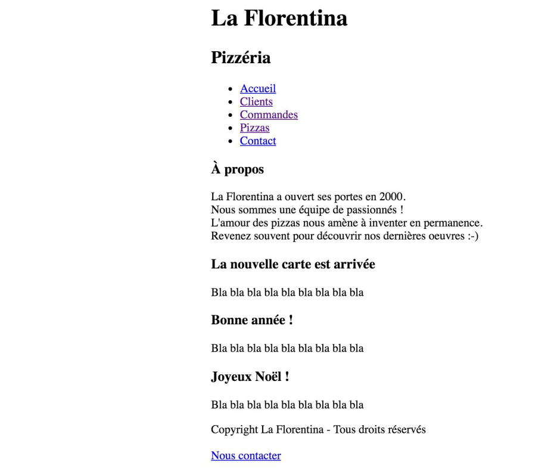

# Projet Pizzeria Web App

L'objectif est de créer une application Web de gestion d'une pizzeria.

# Fonctionnement

Pour lancer l'application, exécuter la méthode `main` de la classe `dev.pizzeria.PizzeriaApp`.

Le contenu du répertoire `src/main/webapp/static` est automatiquement exposé.

Tester l'URL : `http://localhost:8080/images/4fromages.jpg`.

Tester l'URL : `http://localhost:8080/test.html`.

# Fonctionnalités attendues :

> Les données pourront être stockées dans des structures Java.

## Itération 1 : Intégrer la page d'accueil 

* Y ajouter des liens vers la gestion des clients, livreurs, commandes, ...
    

## Itération 2 : Ajouter un client.

> En cas de succès, rediriger vers la liste des clients.

> En cas d'échec, réafficher le formulaire avec un message d'erreur (tous les champs sont obligatoires).

## Itération 3 : Afficher la liste des clients.

## Itération 4 : Ajouter une pizza.

> En cas de succès, rediriger vers la liste des pizzas.

> En cas d'échec, réafficher le formulaire avec un message d'erreur (tous les champs sont obligatoires).

## Itération 5 : Afficher la liste des pizzas.

## Itération 6 : Ajouter un livreur.

* Le livreur a les informations suivantes : `nom`, `prenom`.

> En cas de succès, rediriger vers la liste des clients.

> En cas d'échec, réafficher le formulaire avec un message d'erreur (tous les champs sont obligatoires).

## Itération 7 : Afficher la liste des livreurs.

## Itération 8 : Ajouter une commande.

## Itération 9 :Afficher la liste des commandes.

